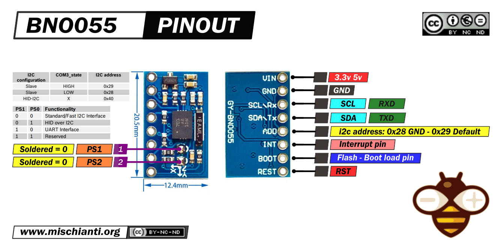
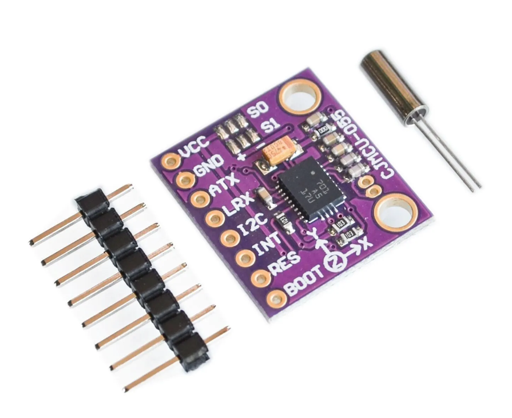
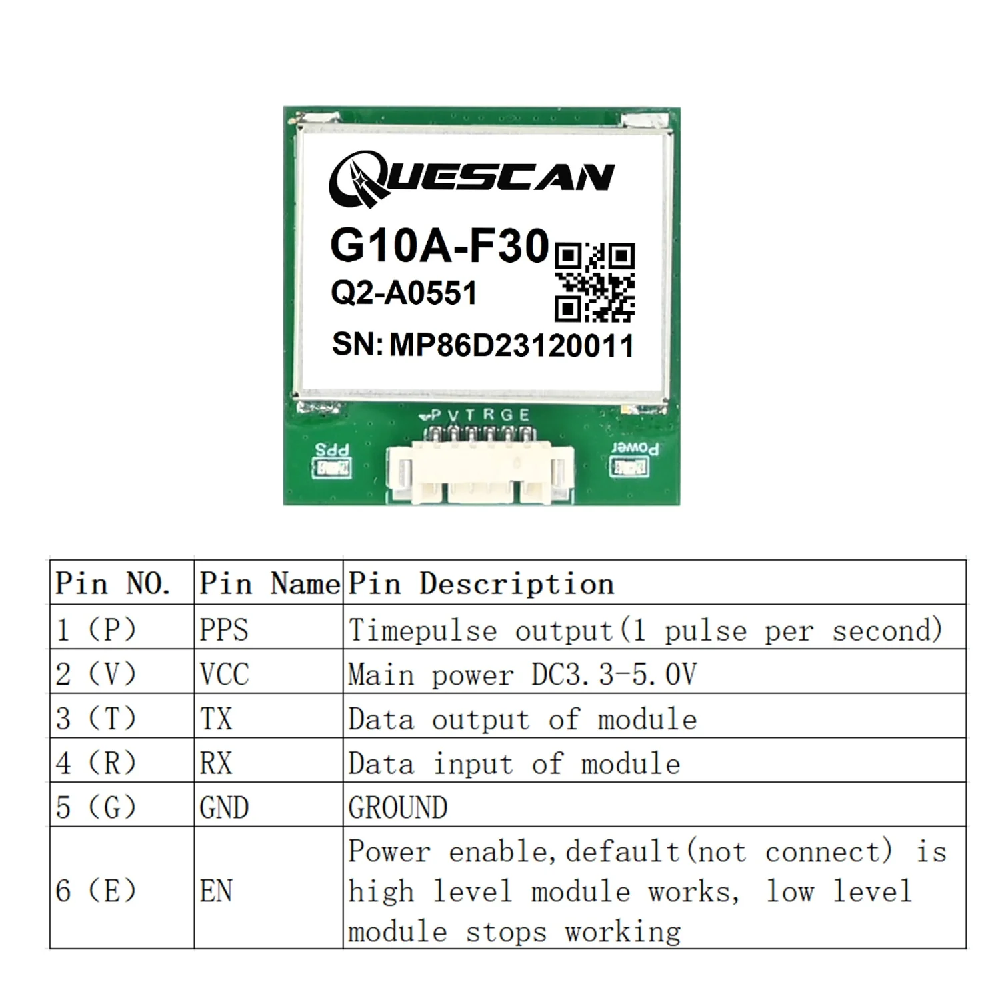
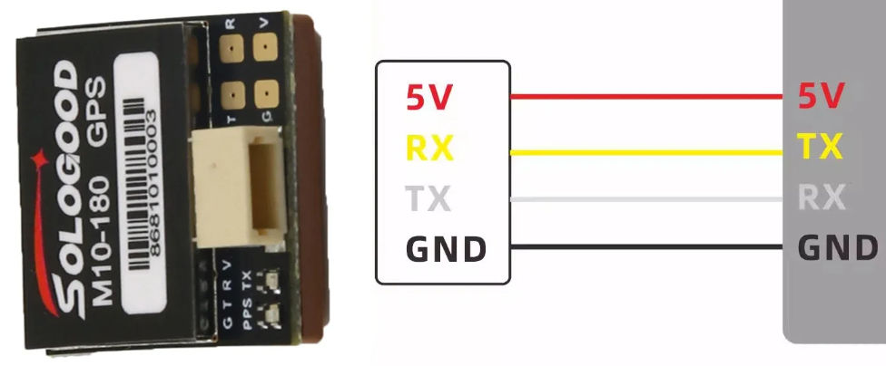
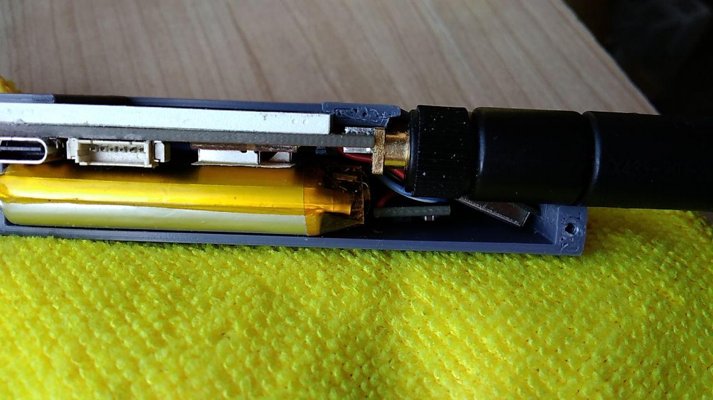

E77-128x160 contains st7735 1.8" and nv3023 2.08" lcd screen options, 
so you can uncomment #define ST7735 or #define NV3023 in the main.h respectively.
#define ST7735 implement bno055 "blue" board and PA5 as MUTE pin, whereas
#define NV3023 implement bno055 "pink" board and PA9 as MUTE pin.
PCB/Schematic_nv3023_PogoPins.pdf presents new pogo pins design.
PCB and CASE folders also contain corresponding st7735 and nv3023 files.
E77-Beacon is for 52x36mm pcb design.
E77-tBeacon is new tiny 36x26mm pcb design. Digital accelerometer ADXL345 on separate expansion board added wia I2C pins PB6&PB7.
Which implements Double Tap and Activity detection.
For the very first time use CubeProgrammer with "Hardware reset" mode. Hold Reset button, press Connect, release Reset button. 
After that Browse for E77-128x160.bin or E77-tBeacon.bin and Start Programming.

As compass it is supposed to use external bno055 "blue" board with LDO.

Although it seemed more reliable "pink" board without LDO. However, it should be found another VCC connection point (after internal LDO). 
S0 and S1 pads sould be soldered to GND

As GNSS module suggested to use 27x27mm QUESCAN with full set of connectors. Power Enable "EN" should not be connected 
(this MCU pin engaged for MUTE purpose)

As GNSS module for tBeacon proposing to use cheap 18x18mm SoloGood which demands soldering PPS after "PPS LED" being removed

or find a more suitable 18x18mm one that has PPS connector

3.7V Li-ion battery 103450 for handheld unit and 802535 or some similar for tBeacon. How it looks inside

##### Some photos
st7735 1.8" and nv3023 2.08" modules

36x26mm PCB tBeacon

52x36mm PCB Beacon

Two tBeacons and st7735 PCB

