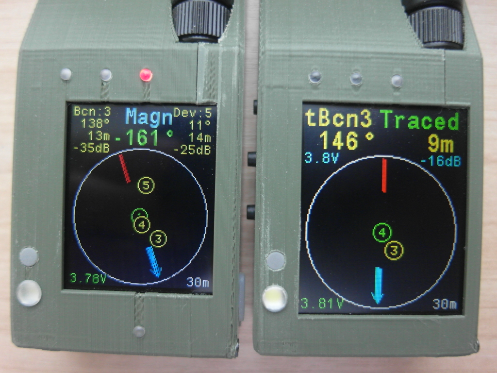
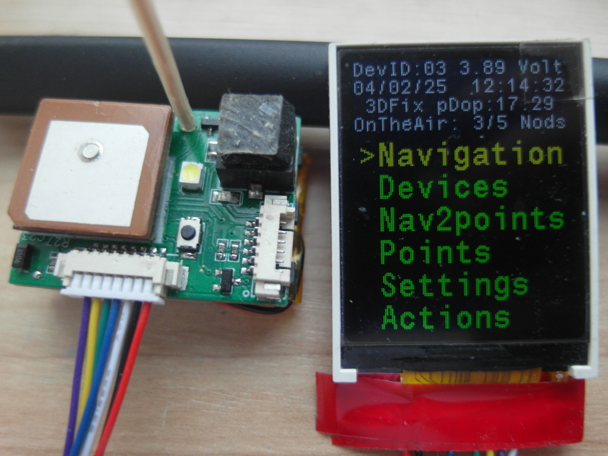
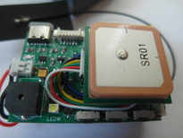
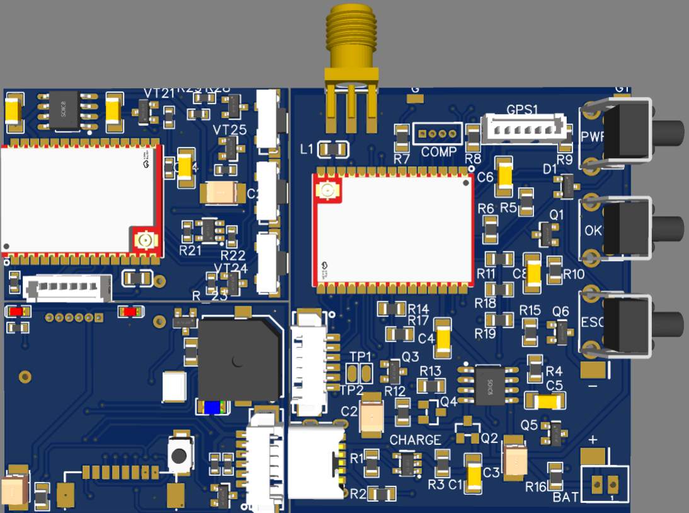

E77-128x160 contains st7735 1.8" and nv3023 2.08" lcd screen options, 
so you can uncomment #define ST7735 or #define NV3023 in the main.h respectively.
PCB and CASE folders also contain corresponding st7735 and nv3023 files.
E77-Beacon is for 52x36mm pcb design.
E77-tBeacon is new tiny 36x26mm pcb design.
For the very first time use CubeProgrammer with "Hardware reset" mode. Hold Reset button, press Connect, release Reset button. 
After that Browse for E77-128x160.bin or E77-tBeacon.bin and Start Programming.
As compass it is supposed to use external bno055 "blue" board bno055blue.jpeg with LDO
although it seemed more reliable "pink" bno055pink.jpeg

##### Some photos
st7735 1.8" and nv3023 2.08" modules

36x26mm PCB tBeacon

52x36mm PCB Beacon

Two tBeacons and st7735 PCB

