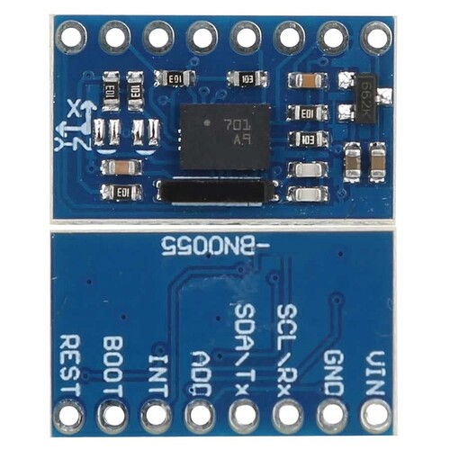

E77-128x160 contains st7735 1.8" and nv3023 2.08" lcd screen options, 
so you can uncomment #define ST7735 or #define NV3023 in the main.h respectively.
PCB and CASE folders also contain corresponding st7735 and nv3023 files.
E77-Beacon is for 52x36mm pcb design.
E77-tBeacon is new tiny 36x26mm pcb design.
For the very first time use CubeProgrammer with "Hardware reset" mode. Hold Reset button, press Connect, release Reset button. 
After that Browse for E77-128x160.bin or E77-tBeacon.bin and Start Programming.

As compass it is supposed to use external bno055 "blue" board with LDO

Although it seemed more reliable "pink" board without LDO and is expected to find another VCC connection point (after internal LDO)

As GNSS module suggest to use QUESCAN with full set of connectors. Power Enable "EN" should not be connected (this MCU pin engaged for MUTE purpose)
##### Some photos
st7735 1.8" and nv3023 2.08" modules

36x26mm PCB tBeacon

52x36mm PCB Beacon

Two tBeacons and st7735 PCB

